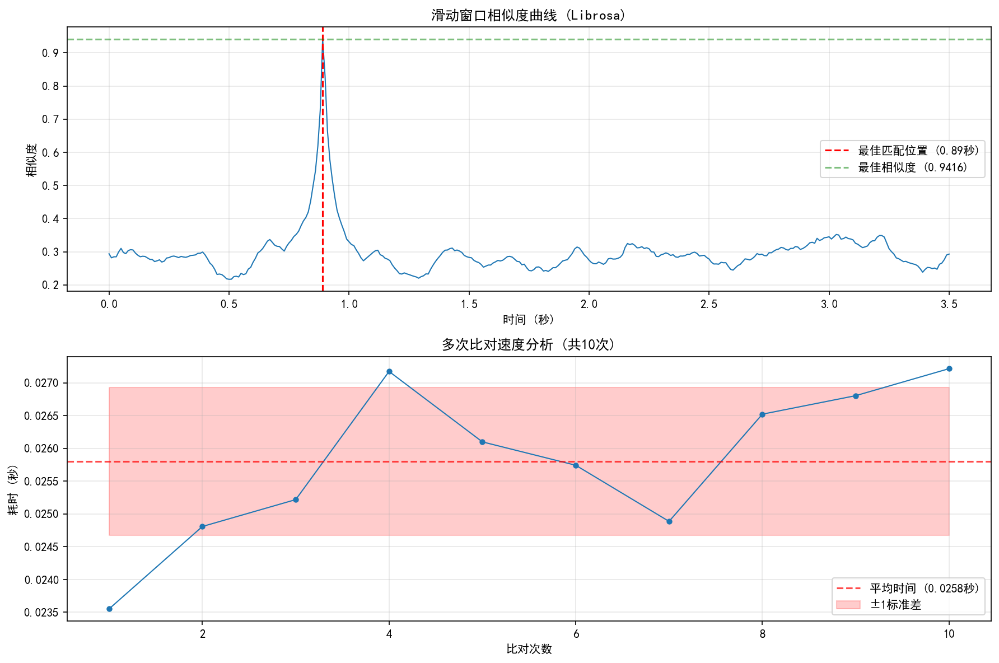
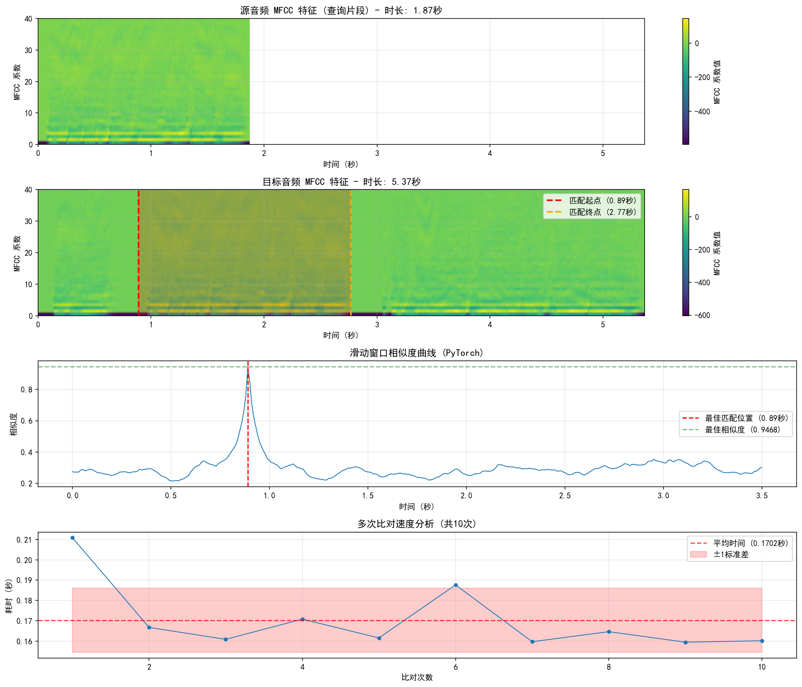

# MFCC-Search

基于 MFCC（梅尔频率倒谱系数）特征的音频相似度搜索工具。支持使用 Librosa 和 PyTorch（支持 GPU 加速）两种实现方式。

## 项目简介

MFCC-Search 是一个用于音频片段匹配和相似度计算的 Python 工具。它能够：

- 提取音频的 MFCC 特征
- 计算两个音频文件的整体相似度
- 使用滑动窗口在目标音频中搜索与查询音频最匹配的片段
- 可视化相似度曲线
- 支持 CPU 和 GPU（CUDA）加速计算

## 功能特性

### 两种实现方式

1. **Librosa 版本** (`mfcc-search-librosa.py`)
   - 基于 Librosa 库实现
   - 简单易用，适合快速原型开发
   - CPU 计算

2. **PyTorch 版本** (`mfcc-search-torch.py`)
   - 基于 PyTorch 和 TorchAudio 实现
   - 支持 GPU 加速
   - 包含性能基准测试功能
   - 提供详细的数据传输和计算时间统计

### 核心功能

- **MFCC 特征提取**：使用标准的 MFCC 参数（40 维，帧长 25ms，帧移 10ms）
- **归一化处理**：每个 MFCC 系数维度独立归一化
- **多维度匹配**：
  - 归一化特征的余弦相似度（权重 0.7）
  - 统计特征（均值、标准差、最大值、最小值）的余弦相似度（权重 0.3）
- **滑动窗口搜索**：在目标音频中滑动查找最佳匹配位置
- **可视化**：生成相似度曲线和性能分析图表

## 环境要求

- Python >= 3.13
- UV 包管理器（推荐）

## 安装

### 使用 UV（推荐）

```bash
# 克隆项目
git clone <repository-url>
cd mfcc-search

# 同步依赖
uv sync
```

### 使用 pip

```bash
docker run --rm -it -v $PWD:/workspace pytorch/pytorch:2.5.1-cuda12.4-cudnn9-runtime bash
pip install -r requirements.txt
```

### 主要依赖

- librosa == 0.11.0
- torch == 2.8.0
- torchaudio == 2.8.0
- torchvision == 0.23.0
- numpy >= 2.3.0
- scipy >= 1.10.0
- matplotlib >= 3.10.8

**注意**：PyTorch 版本配置为使用 CUDA 12.9 加速。如果您的系统不支持 CUDA，程序会自动回退到 CPU 模式。

## 使用方法

### Librosa 版本

```bash
python mfcc-search-librosa.py -t <目标音频路径> -s <查询音频路径>
```

**示例**：
```bash
python mfcc-search-librosa.py -t audio/target.wav -s audio/query.wav
```

### PyTorch 版本

```bash
python mfcc-search-torch.py -t <目标音频路径> -s <查询音频路径> [-n 迭代次数] [-d 设备]
```

**参数说明**：
- `-t, --target`：目标音频文件路径（必需）
- `-s, --source`：查询音频片段路径（必需）
- `-n, --iterations`：比对次数，用于性能测试（默认：10）
- `-d, --device`：计算设备选择（默认：auto）
  - `auto`：自动选择（优先 GPU）
  - `cuda`：强制使用 GPU
  - `cpu`：强制使用 CPU

**示例**：
```bash
# 自动选择设备，执行 10 次比对
python mfcc-search-torch.py -t audio/target.wav -s audio/query.wav

# 使用 GPU，执行 100 次比对进行性能测试
python mfcc-search-torch.py -t audio/target.wav -s audio/query.wav -n 100 -d cuda

# 强制使用 CPU
python mfcc-search-torch.py -t audio/target.wav -s audio/query.wav -n 100 -d cpu
```

## 输出说明

### 控制台输出

程序会输出以下信息：

1. **整体匹配结果**
   - 余弦距离
   - 相似度（1 - 余弦距离）

2. **滑动窗口匹配结果**
   - 查询片段长度（帧数）
   - 目标音频长度（帧数）
   - 最佳匹配位置（帧号和时间）
   - 最佳匹配相似度
   - 匹配片段时间范围

3. **性能统计**（PyTorch 版本）
   - 音频加载时间
   - 重采样时间
   - MFCC 特征提取时间
   - 比对计算时间及统计信息
   - CPU 与 GPU 数据通信统计

### 可视化输出

- **Librosa 版本**：生成相似度曲线图线和性能分析的图表，保存为 `mfcc_librosa_visualization.png`



- **PyTorch 版本**：生成包含相似度曲线和性能分析的图表，保存为 `mfcc_torch_visualization.png`



可视化结果包含四个子图：
1. **源音频 MFCC 特征**：显示查询片段的 MFCC 系数热图
2. **目标音频 MFCC 特征**：显示目标音频的 MFCC 系数热图，并标记最佳匹配位置
3. **相似度曲线**：展示滑动窗口在不同位置的相似度变化
4. **性能分析**：显示多次比对的速度统计信息


## 技术细节

### MFCC 参数配置

- 采样率：16000 Hz
- MFCC 维度：40
- FFT 窗口大小：512（25ms）
- 跳跃长度：160（10ms）
- 窗口长度：400（25ms）

### 相似度计算

使用加权余弦相似度：

$$
\text{similarity} = 0.7 \times \text{sim}_{\text{normalized}} + 0.3 \times \text{sim}_{\text{stats}}
$$

其中：
- $\text{sim}_{\text{normalized}}$：归一化 MFCC 特征的余弦相似度
- $\text{sim}_{\text{stats}}$：统计特征的余弦相似度

### GPU 加速

PyTorch 版本支持 CUDA 加速，可以显著提升处理速度。程序会自动检测 GPU 可用性，并在可用时使用 GPU 计算。

## 性能比较

在支持 CUDA 的系统上，PyTorch GPU 版本相比 CPU 版本可以获得显著的性能提升（具体加速比取决于硬件配置和音频长度）。

使用 `-n` 参数可以执行多次比对以获得准确的性能基准测试结果。

## 项目结构

```
mfcc-search/
├── mfcc-search-librosa.py      # Librosa 实现版本
├── mfcc-search-torch.py        # PyTorch 实现版本
├── TestPytorch.py              # PyTorch 测试文件
├── pyproject.toml              # 项目配置文件
└── README.md                   # 项目说明文档
```

## 许可证

本项目采用开源许可证，具体信息请查看 LICENSE 文件。

## 贡献

欢迎提交 Issue 和 Pull Request！

## 联系方式

如有问题或建议，请通过 Issue 联系。
